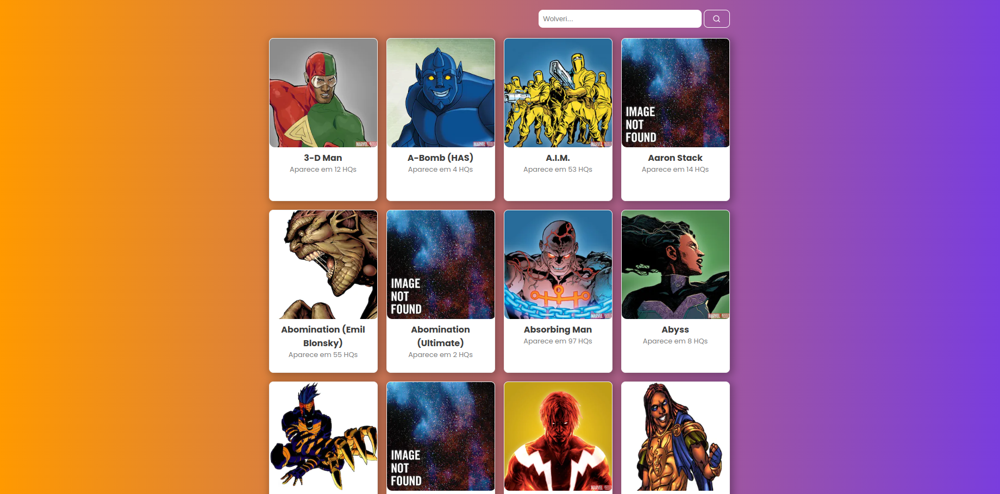
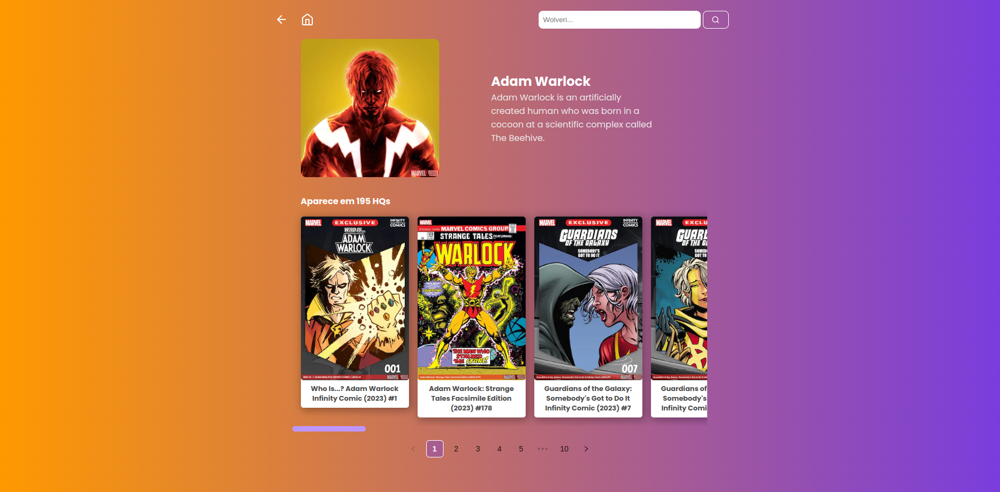
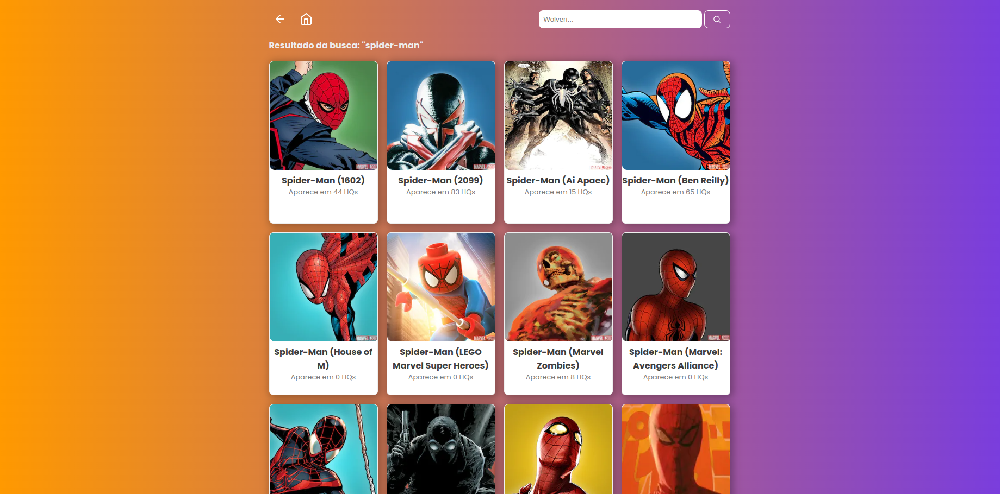
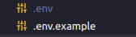
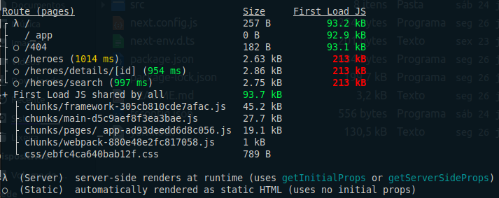

# Find the Hero ([Link do projeto](https://findthehero.vercel.app))


> O Find the Hero é uma aplicação Front-end que te mostra todos os personagens da Marvel Comics e suas HQs.

## ⚙️ Funcionalidades
* Listar todos os personagens
* Ver os detalhes de um personagem e suas HQs
  
* Pesquisar personagens pelo nome
  

## 🛠️ Tecnologias utilizadas
* [TypeScript](https://www.typescriptlang.org/)
* [React](https://react.dev)
* [Next.js](https://nextjs.org/)
* [styled-components](https://styled-components.com/) (CSS-in-JS)
* [Axios](https://axios-http.com/ptbr/)
* [react-hook-form](https://react-hook-form.com/) (Manipulação de formulários)
* [Lucide](https://lucide.dev/) (Ícones)
* [Ant Design](https://ant.design/) (Componente de paginação)

## 🌱 Pré-requisitos
* Instale a última versão do [Node](https://nodejs.org/en/);
* Para garantir o funcionamento de todas as funcionalidades da aplicação é recomendado o uso do [Google Chrome](https://www.google.com/intl/pt-BR/chrome/);
* Para clonar o repositório instale e configure o [git](https://git-scm.com/).

## ▶️ Executando o projeto localmente
#### 1º Abra um terminal e faça o clone do projeto em sua máquina
```bash
git clone https://github.com/SP-Sam/find-the-hero.git

# Se você tem uma chave SSH configurada
git clone git@github.com:SP-Sam/find-the-hero.git
```
#### 2º Navegue até o diretório do projeto clonado e o abra em um editor de código
```bash
cd find-the-hero && code .
```
#### 3º Renomeie o arquivo `.env.example` para `.env` e cole o conteúdo recebido por e-mail


#### 4º Instale as dependências do projeto
```bash
npm install
```
#### 5º Inicie o processo de build do projeto e aguarde até estar finalizado
```bash
npm run build
```
#### Você verá algo parecido com isso no terminal


#### 6º Inicie o projeto
```bash
npm start
```
#### Você verá algo parecido com isso no terminal


#### É só dar um `Ctrl+Click` no link ou colar `http://localhost:3000` no seu navegador e começar a usar!

## 🧪 Executando os testes do projeto
O Find the Hero possui testes unitários. Para executa-los abra um terminal na raiz do projeto e rode o seguinte comando:
```bash
npm test
```
#### Você verá algo parecido com isso no terminal


#### os testes serão executados no `watch mode` do Jest. Para sair do `watch mode` basta apertar a tecla `q` ou `Ctrl+C`.

## 👨‍💻 Desenvolvedor
<a href="https://www.linkedin.com/in/spsam/">
  
  <br>
  <b>Samuel Pereira</b>
</a>

## 🖋️ Licença
Este projeto é um desafio técnico para um processo seletivo da empresa [Fpass](https://www.fpass.com.br/), não possui fins lucrativos e não está licenciado.

[⬆️ Voltar ao topo](#find-the-hero)
<br>
